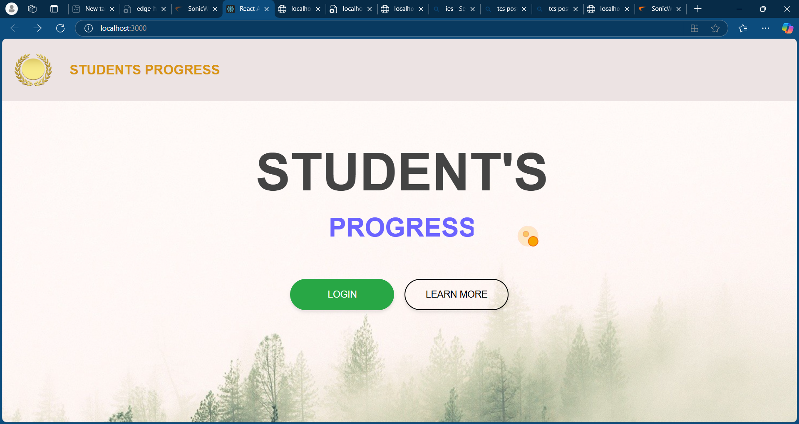

# 🎯 Students Progress and Placement Eligibility System

## 📚 Overview
The **Students Progress and Placement Eligibility System** is a web-based application designed to track students' academic progress and determine their eligibility for campus placements. It automates the process of monitoring grades, attendance, and skills, offering real-time insights for both students and placement officers.

## 🚀 Features
- 📊 **Student Dashboard:** View academic records, attendance, and skill assessments.
- 🔒 **Admin Panel:** Add, update, and manage student data.
- ✅ **Placement Eligibility Check:** Automated evaluation of placement criteria based on pre-defined rules.
- 📈 **Progress Reports:** Generate detailed progress reports and visual analytics.
- 📢 **Notifications:** Alerts for students nearing or falling below the eligibility threshold.
- 📱 **Responsive Design:** Accessible on both desktop and mobile.


## 🏗️ Tech Stack
- **Frontend:** HTML, CSS, React
- **Backend:** Node.js json Server
- **Database:**  MongoDB
- **Other Tools:** Git, Docker, Postman
## 📸 Project Screenshots

Here are some screenshots showcasing the **Students Progress and Placement Eligibility System**:




## 🔥 How to Run the Project

Follow these steps to set up and run the project locally:

1. **Clone the repository:**
   ```bash
   git clone https://github.com/yourusername/students-progress-placement-system.git

2. **Install dependencies:**
   ```bash
   npm install
3. **Run the server:**
   ```bash
   npm Start
## 📞 Contact

For any queries or feedback, feel free to reach out:

- 📧 **Email:** [balamuruganmbg4@gmail.com](mailto:email@gmail.com)
- 🐙 **GitHub:** [yourusername](https://github.com/yourusername)
- 📄 **LinkedIn:** [Your LinkedIn](https://linkedin.com/in/yourprofile)
